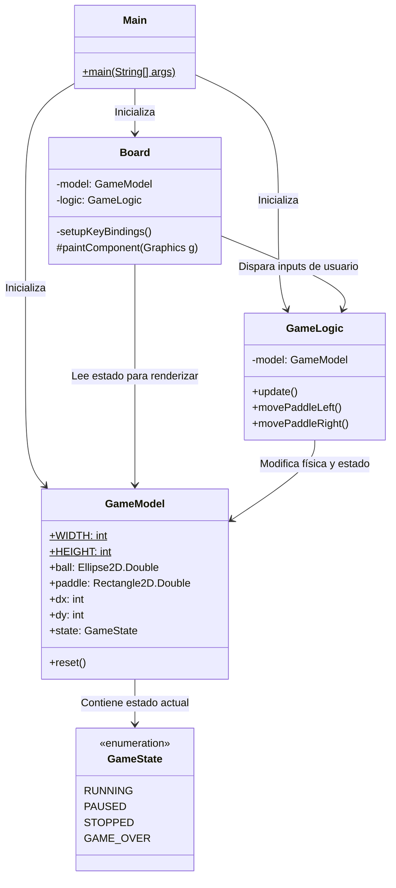

# Diagrama de Clases UML (Arquitectura Refactorizada)

```mermaid
classDiagram
    class Main {
        +main(String[] args)$
    }
    
    class GameState {
        <<enumeration>>
        RUNNING
        PAUSED
        STOPPED
        GAME_OVER
    }
    
    class GameModel {
        +WIDTH: int$
        +HEIGHT: int$
        +ball: Ellipse2D.Double
        +paddle: Rectangle2D.Double
        +dx: int
        +dy: int
        +state: GameState
        +reset()
    }
    
    class GameLogic {
        -model: GameModel
        +update()
        +movePaddleLeft()
        +movePaddleRight()
    }
    
    class Board {
        -model: GameModel
        -logic: GameLogic
        -setupKeyBindings()
        #paintComponent(Graphics g)
    }

    Main --> Board : Inicializa
    Main --> GameModel : Inicializa
    Main --> GameLogic : Inicializa
    Board --> GameModel : Lee estado para renderizar
    Board --> GameLogic : Dispara inputs de usuario
    GameLogic --> GameModel : Modifica física y estado
    GameModel --> GameState : Contiene estado actual
```
